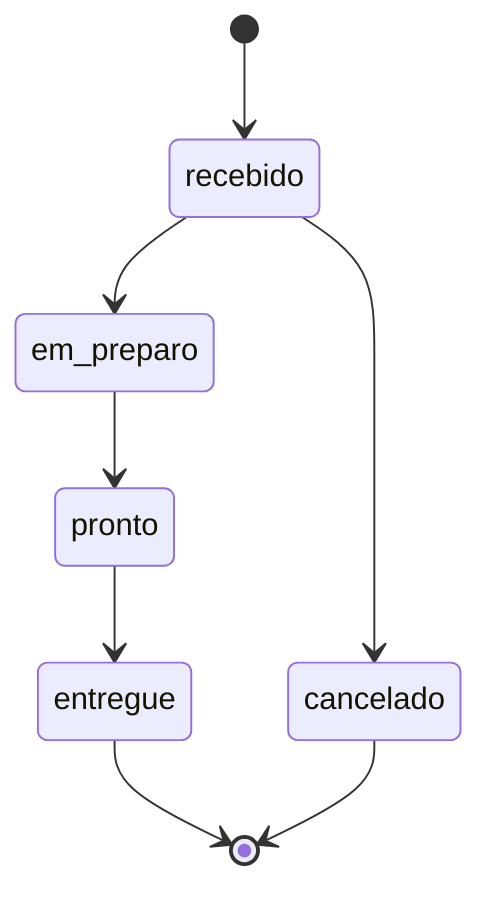

# Pizzaria — DDD em TypeScript

O backend aplica Domain-Driven Design ao fluxo de uma pizzaria: cadastrar clientes e pizzas, realizar pedidos, acompanhar o preparo e concluir a entrega ou retirada. A API HTTP usa NestJS e PostgreSQL, com frontend Vue servido pelo NGINX. A demonstração de terminal continua disponível com armazenamento em memória.

## Executar

Para subir a stack completa com Docker:

```bash
cd devops
cp .env.example .env
docker compose up -d --build --wait
```

Acesse http://localhost:8080 e verifique a conexão em http://localhost:8080/api/health. Configuração, rotas, exemplos e desenvolvimento local estão em [devops/README.md](devops/README.md).

Para executar somente a demonstração de terminal, com Node.js 24 ou superior e npm:

```bash
cd backend
npm ci
npm run demo
```

A demonstração cadastra Maria e uma Margherita grande, realiza um pedido de duas pizzas de R$ 45,90 e percorre o fluxo até a entrega, imprimindo o total de R$ 91,80.

```bash
npm test
npm run typecheck
npm run build
# npm start inicia a API e requer as variáveis de PostgreSQL configuradas.
```

## Modelo de domínio

O domínio está organizado em três módulos dentro do mesmo backend. São limites iniciais de responsabilidade, sem necessidade de microsserviços:

| Módulo | Responsabilidade | Raiz de agregado |
| --- | --- | --- |
| Clientes | Identificação e contato do cliente | `Cliente` |
| Cardápio | Sabor, tamanho, preço e disponibilidade | `Pizza` |
| Pedidos | Itens comprados, atendimento, total e ciclo de vida | `Pedido` |

`Pedido` é o núcleo desta implementação. Referencia o cliente por ID e contém seus `ItemPedido`, que não possuem repositório próprio. Cada item registra o ID, nome, tamanho e preço da pizza no momento da compra, preservando o histórico quando o cardápio muda. O caso de uso `RealizarPedido` coordena a consulta aos módulos de Clientes e Cardápio antes de salvar o agregado completo.

`Dinheiro` e `Endereco` são objetos de valor: não têm identidade própria, são imutáveis e oferecem comparação por conteúdo. `ItemPedido` também é um objeto de valor imutável, sem identidade independente. Clientes, pizzas e pedidos têm identidade e são agregados imutáveis: operações como `alterarPreco` e `alterarStatus` retornam uma nova versão, que deve ser salva pelo caso de uso.

A linguagem usada no código corresponde ao negócio: cliente, pizza, tamanho, pedido, item, entrega, retirada e preparo. Nesta versão, cada sabor/tamanho corresponde a uma pizza distinta do cardápio; `entregue` significa tanto entrega ao endereço quanto retirada concluída.

## Regras implementadas

- Cliente deve ter nome e telefone com DDD; pizza deve ter tamanho válido e preço positivo.
- Pedido exige cliente cadastrado e pelo menos um item de pizza existente e disponível.
- Quantidades são inteiros positivos. Preços vêm do cardápio e são expressos em centavos de BRL, com validação de inteiros seguros.
- O total é calculado pelos itens; quem solicita o pedido não informa preços ou total.
- Entrega exige rua, número, bairro e cidade. Retirada não exige endereço.
- O cancelamento só é permitido enquanto o pedido está recebido.
- Itens e valores ficam fixos após a criação do pedido.



## Organização e dependências

```text
backend/
  src/
    domain/
      clientes/         Cliente e contrato do repositório
      cardapio/         Pizza e contrato do repositório
      pedidos/          Pedido, ItemPedido, Endereco e contrato do repositório
      shared/           Dinheiro e erros de domínio
    application/        CadastrarCliente, CadastrarPizza, RealizarPedido,
                        ConsultarPedido e AlterarStatusPedido
    infrastructure/
      database/         Conexão PostgreSQL e migrações versionadas
      repositories/     Implementações em memória e PostgreSQL
    http/               Controllers, DTOs e tratamento de erros
    app.module.ts       Composição do NestJS com PostgreSQL
    main.ts             Servidor HTTP
    composition-root.ts Instancia e conecta as dependências
    index.ts            Demonstração no terminal
  test/                 Regras de domínio e integração dos casos de uso
```

O domínio não depende de framework, banco de dados ou Node.js. A aplicação depende do domínio e dos contratos de repositório. A infraestrutura implementa esses contratos. A composição injeta repositórios e o gerador de IDs nos casos de uso. O módulo NestJS escolhe os repositórios PostgreSQL; a demonstração e os testes de domínio usam memória.

Os testes verificam cálculos monetários, validações, transições de status, proteção dos itens, preservação do preço histórico, ausência de gravação em operações rejeitadas e o fluxo completo dos casos de uso.

## Exemplo com Prisma

`backend/prisma/schema.prisma` contém um exemplo isolado de uso do [Prisma](https://www.prisma.io) como ORM, com um model `Categoria`, independente do restante do backend (que usa o cliente `pg` diretamente). A classe `CategoriaRepositoryPrisma` em `backend/src/infrastructure/repositories/categoria-prisma.ts` demonstra criar, listar, buscar e remover categorias. Para experimentar:

```bash
cd backend
cp .env.example .env   # preencha DATABASE_URL com um PostgreSQL acessível
npm run prisma:migrate # cria a tabela categorias
npm run prisma:generate
```

## Escopo

Na API, os dados persistem no PostgreSQL e no volume Docker. Pedidos são gravados atomicamente com seus itens; alterações de status verificam o estado anterior para impedir gravações concorrentes conflitantes. A demonstração de terminal continua descartando os dados ao encerrar. Pagamentos, estoque, taxas de entrega, pizzas meio a meio e autenticação não fazem parte desta implementação. O frontend em `devops/` verifica a conexão com a API e o banco.
